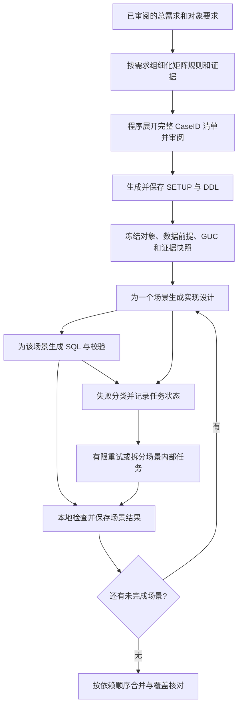

# CORE 分阶段生成方案 v2

日期：2026-09-08。方案分支：`feature/intranet-core-design-v2`。

状态：设计提案，尚未实现。本文的配置、数据结构和新文件名均为拟议内容；当前运行配置不支持它们。内网适配背景见 [适配总结](INTRANET_LLM_ADAPTATION.md)。

## 1. 目标与方案选择

把 CORE 改为一组有明确输入、有限输出、可单独保存结果的任务：按测试目标制定规则，程序展开全部组合，模型逐个设计和生成完整测试场景，程序校验并合并。内网服务的单次思考上限按 1200 秒处理，每次请求在本地最多运行 900 秒，正常任务以数分钟完成为目标。整个 CORE 可以超过 20 分钟。

全量覆盖、必要的推理能力、已有 DDL 对象和 before/op/after 语义都保留。超时恢复使用已保存的结构化结果，不依赖服务端继续上一段隐藏思考，也不依赖模型保存会话。

前一版按固定数量批量生成的建议还有三个缺口：用例清单本身可能是一个超长规划请求；一个复杂 case 也可能超时；只核对 CaseID 数量无法保护数据状态、GUC 和前后对比关系。此次把这些问题纳入首版实现范围。

## 2. 当前代码为什么容易超时

| 当前证据 | 对方案的影响 |
| --- | --- |
| [CORE.md](../node_prompts/CORE.md) 要求一次抽取全部 OP、建立矩阵、展开最细用例、生成所有 SQL、输出覆盖自检 | 需要拆分推理职责和输出量；不能继续把原完整提示词交给每个小任务 |
| [orchestrator.py](../app/workflow/orchestrator.py) 在 SETUP/DDL 后只调用一次 `run_phase("CORE", ...)` | 需要专门的 CORE 调度流程 |
| [planner.py](../app/workflow/planner.py) 的 `build_phase_plan("CORE")` 也是一次完整 refiner 调用 | 新规划必须按需求组分解，避免把瓶颈搬到 CORE_PLAN_REFINER |
| [agent.py](../app/nodes/agent.py) 的 `_enrich_payload_with_knowledge()` 会覆盖传入的知识缓存并追加共享缓存 | 小任务需要显式的局部证据模式，否则裁剪后仍会被自动扩回完整上下文 |
| 当前示例阶段超时为 1800 秒；节点还有 JSON 重试、两阶段回退，provider 默认重试 2 次 | 需要统一预算和重试入口，不能只在外层套一个批次超时 |
| [checkpoint.py](../app/services/checkpoint.py) 只保存 planner、setup_plan、ddl_plan、core_plan | 首版就需要保存 SETUP/DDL 产物和 CORE 子任务；仅恢复计划会重新生成对象 |
| 阶段异常默认可触发通用 SQL fallback；[MockSqlExecutor](../app/executors/mock_sql_executor.py) 只检查是否有非空 SQL | 不完整用例不能借 fallback 或 mock 成功被报告为整轮成功 |

这些是代码层面的原因；没有内网请求日志，不能据此判断 502 全都由 reasoning 超时导致。实现时应记录请求开始、首事件、首正文、结束、错误类型和服务端 request ID（若提供），分别观察排队、推理和输出时间。

## 3. 工作流



图中描述的是 SQL 文件生成，不是在模型请求期间执行数据库操作。失败且无法继续的场景会被记录；其他无依赖的场景可继续。只有通过检查的完整场景进入可合并结果。

### 步骤 A：按需求组细化规则，不让模型一次列出所有 case

以 `global_plan.requirement_decomposition`、`coverage_matrix` 和显式 `must_cover` 为起点，为需求叶子分配稳定的 `requirement_id`，保存它们对应的原始需求文本。每个规划请求只处理一个边界清晰的 OP/需求组和该组证据。

模型输出 `CoreGroupSpec`：目标、维度及取值、覆盖规则、特殊例外、对象能力要求、前置条件、证据引用和结果判定方法。例如输出“连接类型取值 × 实现路径取值 × 参数模式取值”以及约束，而不逐条复述几百个组合。跨功能交互作为显式需求组保留，不因按 OP 分组而丢弃。

程序执行受限、可校验的维度组合与约束规则，生成稳定的 CaseID。约束不能是模型输出的任意 Python 表达式；采用明确的字段匹配和布尔组合等声明式形式。全枚举需求不自动改成最小覆盖。显式不支持的组合仍保留 ID 和证据；证据不足的组合也保留，后续补证或标记 BLOCKED。

不规则、不能由笛卡尔积描述的场景，按有边界的需求叶子生成显式列表；每页绑定具体需求或组合区间并保存进度，不能仅根据模型说“没有更多了”就认定完整。分组本身过大时按已知需求子树或维度取值分片；模型不得另起一次“重新设计全部用例”的大请求。

本地生成的清单应包含 `requirement_id → group_id → case_id` 映射。程序可以检查遗漏的引用和组合，但无法自动证明自然语言需求已被完整理解；沿用项目审阅步骤，向用户展示分组、维度、数量、例外和未映射需求。自动审批模式需在报告中明确这项语义检查未经过人工确认。

当前 `PhasePlan.test_focus` 是字符串列表，不能直接当可靠的机器可执行用例表。新增独立的 `CoreGroupSpec` / `CoreManifest`，保留 `PhasePlan` 作为审阅摘要；由专门流程逐组生成并汇总，替换当前一次性 CORE refiner 细化路径。旧计划恢复时只重建缺少的结构化 CORE 信息，不要求重新做全部总规划。

### 步骤 B：冻结生成契约，先确认场景确实有可用前提

在生成 CORE SQL 前，保存 SETUP 和 DDL 的实际产物，形成版本化 `CoreContract`，至少包含：

- 数据库方言、版本条件、表/列/视图/索引和相关 DDL。
- 前置数据由谁准备、何时有效、允许哪些场景修改；必要的统计信息条件。
- SETUP 确立的共享 GUC 值，以及场景临时设置应恢复到的值或有证据的恢复方式。
- 证据快照及 ID、来源位置和内容哈希；允许使用的语法与限制。
- 场景间依赖、全局基线、共享清理的所有权和执行位置。

不能假设现有 `required_setup_objects` 已完整反映实际生成的 DDL。应优先复用结构化对象信息，对照实际 DDL 检查；解析不了的部分保留相关原文并标记未确认，不用简单正则推断全部方言语义。

如果发现实际 DDL 缺少必需的列、索引或数据能力，先报告契约问题并回到对应计划/产物修订；CORE 子任务不得自行给共享表换名字或悄悄补建不同版本的表。契约变化后，按依赖使相关任务失效。

### 步骤 C：一个场景先做实现设计，再生成 SQL

首版默认以一个完整测试场景为调度单位。多个 case 若共同依赖不可分割的状态变化或前后基线，可属于同一 `scenario_id`，但每个 CaseID 的覆盖记录仍独立。

第一个请求输出紧凑的 `CaseRecipe`：固定维度、对象绑定、SQL 结构、参数及恢复方式、EXPLAIN 期望、结果判定、证据引用和步骤依赖。这是后续可复用的明确设计结论，不要求模型输出隐藏思维链。

第二个请求根据已校验的 recipe 生成 `CaseArtifact`。输入只含本场景需求、固定契约的相关切片和所引用的证据；保留适用的全局约束。输出为带步骤 ID 的完整 SQL 块、覆盖 ID 和校验元数据，不重复整个知识库及全量清单，也不把之前所有场景 SQL 当对话历史追加。

简单且已具备完整 recipe 的规则化场景可以直接生成 SQL，减少调用次数。初版不以“每批 6 个 case”作为固定前提；后续只有在测得输入、输出和耗时都足够小时，才合并少量互不依赖的场景请求。批量大小是性能选项，不影响清单和覆盖要求。

设计和生成节点可分别绑定 provider；首版沿用用户选择的 thinking 设置，不自动关闭推理。可单独评估 recipe 固定后的 SQL 生成是否适合关闭 thinking，但必须比较覆盖和 SQL 质量，再调整运行配置。

对用户需要对照的场景，baseline、op、assertion 必须绑定同一份输入和判定条件。通常保持一个完整场景输出 before/op/after；如果必须分开生成，也共享已冻结的 recipe、步骤 ID 和变量/对象名，整个场景检查通过后才发布。全局 before 只生成一次，共享 cleanup 只在所有消费者之后执行。

### 步骤 D：单个复杂场景超时，也有可继续的工作边界

已知重型场景可预先拆解；普通场景达到截止时间后只拆失败部分。例如：

```text
场景 S17
  design/object_binding    对象和列映射
  design/control          GUC、Hint、语法结构和证据
  design/oracle           前后对照与结果判定
  sql/baseline            必要时生成基线
  sql/op                  生成目标 SQL
  sql/assertion           生成验证 SQL
  sql/restore             生成有证据的状态恢复
  validate/scenario       本地检查，成功后才发布 S17
```

这是同一场景的产物依赖图；各任务以已保存的前置结果为输入，不从半截 JSON 或半截 SQL 后面盲目续写。`sql/assertion` 必须引用确定的 `sql/op` 及 oracle；`sql/op` 改变时，下游 assertion 和场景校验失效。

拆分后的 `sql/op` 若仍包含一条必须整体生成的复杂语句，可以先细化结构设计，但不能按字符切开 SQL 再假定拼接正确。达到最小任务后仍然超时，记录 FAILED 并保留其余成果；系统不能保证任意复杂需求在给定服务能力下都能生成成功。

## 4. 请求时间预算与错误处理

以下是首轮内网试运行的建议值，不是性能测量结论：

| 范围 | 初始建议 | 语义 |
| --- | --- | --- |
| 服务限制 | 1200 秒 | 用户给出的边界，保守按完整请求处理 |
| 每次请求主动截止 | 900 秒 | 从发起调用前开始累计，包含连接、排队、推理和流式输出；收到 token 不重置 |
| 常规任务耗时目标 | 180–480 秒 | 据日志调整粒度，900 秒是截止线，不是预期耗时 |
| 生成并发 | 1 | 同一轮串行，避免同时堆积多个内网推理请求 |
| SDK 自动重试 | 0（新 CORE 路径） | 由调度器统一分类、计数、退避和记录 |
| 瞬时故障额外重试 | 最多 1 次 | 每次请求有独立截止时间；计数持久化，恢复不自动清零 |
| 局部模型修复 | 最多 1 次 | 只修对应任务，使用小输入，仍受截止时间约束 |
| 自动拆分深度 | 最多 3 层 | 子任务必须缩小范围或明确分离职责；禁止生成与父任务输入及目标相同的循环任务 |
| 规划/生成输出上限 | 先试 4K / 8K token | 需按网关语义验证；截断算失败，不能当完整结果 |
| 整轮 CORE 总预算 | 独立可配 | 不继承旧的整阶段 1800 秒截止；预算耗尽保存进度并返回未完成 |

时间限制必须覆盖 CORE 规划、实现设计、SQL 生成、模型修复等所有调用。`max_turns` 或 `max_output_tokens` 都不能代替墙钟时间限制；网关是否把 reasoning 计入 token 上限也不能预先假定。

底层发送、流式消费、节点内部重试必须使用同一请求 deadline。新路径绕开现有“JSON 失败后自动重跑节点再走两阶段 fallback”的嵌套重试机制。每次完成或失败都收集结束原因（接口提供时）并校验完整结构；只能进行不补造内容的本地格式修复，不能靠默认字段、占位 SQL 将失败变成成功。

到期需要取消 runner、关闭响应流和清理后台任务。单独 `asyncio.wait_for` 不足以证明后台连接已释放，实施时要检查所用 SDK 的取消行为并做故障测试；若不能在短宽限期内回收，采用可终止的请求子进程隔离。客户端关闭不保证服务端立刻停止推理：可用网关取消接口则调用；否则保留请求标识和冷却/限流状态，超时后至少等待原请求达到 1200 秒边界再发该工作流的替代请求，避免立即叠加；服务端排队、取消语义仍需实测。

错误按原因分流：

- 900 秒超时、输出过大或截断：保存失败尝试，分解失败任务，不原样反复发送大请求。
- 临时网络错误、可恢复 5xx 或限流：按服务端提示或有限退避重试一次；同一轮连续瞬时故障触及阈值（初始可设 3 次）时暂停调度并保存进度，不遍历全量 case 消耗请求。
- 鉴权、模型名、TLS 或不支持参数：保留已完成结果，暂停该 provider 的调度并报告配置原因；拆 case 对这些错误无效。
- JSON/结构错误：先本地保守解析，必要时一次局部修复；失败则保留失败状态。
- 缺证据或明确不支持：保持覆盖条目，标记 BLOCKED 并注明依据及替代方向；网络失败不能记成 BLOCKED。
- 用户中断：停止发新任务，保留完成项；不把取消当成模型错误触发自动重试。

知识检索在分组阶段完成并缓存，不放进 SQL 生成请求里。当前 Claude CLI 知识检索的 18000 秒配置必须与模型单请求预算分开；若该 CLI 也调用受限网关，需要沿用小主题检索及其服务端请求限制，不能因为外层子进程允许 5 小时就认为内部请求安全。证据无法获取时显式记录，生成阶段不通过扩大上下文或无限检索补救。

## 5. 进度持久化与恢复

持久化从首版启用。建议在现有 `logs/<run_id>/` 中新增：

```text
execution/
  setup_result.json
  ddl_result.json
  core/
    contract.json
    manifest.json
    groups/<group_id>.json
    recipes/<scenario_id>.json
    tasks/<task_id>/attempt-<n>.json
    scenarios/<scenario_id>.json
    report.json
```

任务状态为 `PENDING / RUNNING / SUCCEEDED / FAILED / BLOCKED / SUPERSEDED`。拆分父任务后记为 SUPERSEDED，并记录子任务 ID；只有所有必需子任务成功，父场景才能成功。manifest 同时保存调度顺序、依赖、尝试次数和产物哈希。

每个成功结果先写同目录临时文件、flush/fsync 后原子替换，再更新索引；需要耐久保证时同步目录。恢复必须能处理“产物已写、索引未更新”的窗口，重新校验孤立产物后登记。损坏文件单独标记，不能让整个 CORE 重头生成。文件系统原子替换/锁语义需在实际挂载上验证。

同一 run 只允许一个写入者；当前 PID 文件检查不能直接当可靠的排他锁，需要在入口接入可用的进程锁。崩溃遗留的 RUNNING 转为待恢复状态，检查产物和已保存的预算后再调度。恢复命令延续 `--resume <run_id>`。

恢复是否可复用取决于契约、需求/矩阵、证据、提示词、输出 schema 和生成参数的指纹，不仅是 CaseID 相同。模型配置变化可以显式选择新任务版本，避免无提示混用；无关的文档提交不应让全部结果失效。依赖改变时使其消费者失效，不覆盖旧结果。源码接口/生成逻辑变化通过明确的任务版本参与校验。

升级 checkpoint 结构时要兼容当前 v1 的规划数据；新增执行数据缺失就补做，不宣称旧日志里有 CORE 进度。`--force` 清理范围也需覆盖新执行 checkpoint，并清楚展示将重置哪个 run。

这里恢复的是 SQL 生成进度。未来连接真实数据库后，数据库事务和执行恢复是另一套状态，不能用“SQL 文件已生成”推导“数据库操作已完成”。

## 6. 本地合并与完成判定

合并器按依赖排序，输出全局前置块、完整场景、末尾共享清理和覆盖报告。不会再让一个 LLM 读取全量 SQL 做最终重写，否则会重新制造长请求。

合并前至少检查：

1. 所有必需需求都有 case 或明确的规划问题，枚举范围与批准的覆盖规则一致。
2. 期望 CaseID 集合与实际记录逐项对应，不只比较数量；不能用重复 case 补齐缺失 ID。
3. 每个成功场景具备所要求的语句角色、证据引用和参数恢复；依赖没有环、缺失或失败的前置。
4. 全局对象名来自同一 DDL 版本；共享对象清理位于最后一个消费者之后。
5. 涉及数据修改的场景有隔离、还原或显式依赖顺序；生成并发顺序不能决定最终 SQL 执行顺序。
6. 临时 GUC 恢复到契约要求的共享值。若 SETUP 已设置非默认值，不能用一个无条件 `RESET` 假定恢复正确。
7. 本地生成 coverage 注释和机器可读报告，模型自己输出的“Missing: 0”不作为验收依据。

如果状态恢复策略或前后对照语义不能确定，场景不能标成完整。共享 GUC 块只在确认边界和恢复语义后复用，不为节省几个 SET 语句牺牲独立性。

覆盖报告定义互不重叠的四个集合：成功生成 `S`、证据/支持限制阻塞 `B`、技术失败 `F`、尚未完成 `P`；期望集合 `E = S ∪ B ∪ F ∪ P`，并检查没有多余 ID。记录全代表“可追踪”，不代表全部测试已实现。

只有 `S = E` 且场景检查通过，才报告 `COMPLETE`；仅剩有依据的 BLOCKED 时报 `COMPLETE_WITH_BLOCKERS`；还有 FAILED/PENDING 或规划未完成则为 `INCOMPLETE`。后两种不打印当前入口的成功完成文案，也不以退出码 0 表示全量完成。

保持 `PhaseResult.generated_sql` 等现有字段供下游消费，同时为最终结果增加有默认值的生成状态、覆盖统计和报告位置。不能把结构化失败信息只藏进 `unresolved_risks`，也不能让 `MockSqlExecutor` 的非空判断覆盖生成状态。INCOMPLETE 输出明确命名的部分产物和恢复提示，不按完整 SQL 包交付。

这些本地检查是结构、覆盖映射与部分约束检查，不能证明方言语法、执行计划命中和查询结果正确。数据库语义需要目标数据库执行/EXPLAIN 验证，或人工审阅；该能力不应在本次调度改造中被声称已经具备。

## 7. 一个完整例子

假设用户明确要求 `4 种逻辑变体 × 3 种实现路径 × 2 种参数模式`，理论上有 24 个 case。这是调度例子，不代表目标数据库支持这些全部组合。

规划请求输出该组的三个维度和证据规则；程序生成 24 个稳定 ID。若证据明确说明其中 4 个不支持，保留 4 条 BLOCKED，另外 20 条进入设计/生成队列。

生成到第 13 个场景时，SQL 请求达到 900 秒：前 12 个成功结果及第 13 个已完成的 recipe 均保留；第 13 个只分解失败的 SQL 工作，其他无依赖场景继续。若进程随后退出，恢复时读取固定 SETUP/DDL、契约和已完成结果，继续未完成任务。

如果第 13 个最终仍失败，结果就是 `19 成功 + 4 BLOCKED + 1 FAILED = 24 已记录`，状态 INCOMPLETE；修复后是 `20 成功 + 4 BLOCKED`，状态 COMPLETE_WITH_BLOCKERS。两种都不能写成“24 个用例全部生成成功”。

## 8. 实施范围及验收

建议按以下顺序编码，但达到首版交付时必须同时具备拆分、超时、checkpoint 和严格完成判定：

| 改动位置 | 计划内容 |
| --- | --- |
| `app/schemas/models.py`、schemas 导出 | 结构化组规则、manifest、contract、recipe、场景产物和最终生成状态 |
| `app/workflow/planner.py`、`node_prompts/CORE_PLAN_REFINER.md` | CORE 按需求组取证和规划，本地展开；不新增全量清单的大模型调用 |
| 新增 `app/workflow/core_pipeline.py` | 依赖调度、有限重试、复杂场景分解、恢复和本地合并 |
| 新增 CORE group/design/SQL 提示词 | 分别约束一个任务的输入输出；把全量枚举和覆盖统计责任交给程序 |
| `app/nodes/agent.py`、`app/services/providers.py` | 局部证据注入、受控单次调用、取消清理、避免嵌套重试；复用现有 GLM/TLS 适配 |
| `app/services/checkpoint.py`、`app/main.py` | 原子持久化、锁、v1 迁移、resume/force、正确结束状态与退出码 |
| `app/workflow/orchestrator.py`、质量检查 | 保存 SETUP/DDL，接入 CORE pipeline，执行生成完整性门禁 |
| `app/config.py`、配置示例、部署文档 | 新增独立 `core_execution` 配置，声明截止时间、总预算、输出上限和重试策略 |
| `app/ui/console.py`、日志 | 显示当前任务、成功/阻塞/失败数量、耗时和恢复位置；保留终端输入适配 |

验收分为本地确定性测试和内网实测：

- 用假模型展开至少 100 个 case，检查需求映射、稳定 ID、无重复/遗漏、BLOCKED 不被丢弃；证明单个规划请求不承担全量展开。
- 注入第 N 次超时、流式中断、JSON 截断、进程退出，缩短测试截止时间后检查取消清理及只恢复失败/未完成任务；持久化中途失败不能误记成功。
- 用包含数据变更、GUC 覆盖、共享基线和清理依赖的场景检查拼接顺序；recipe/op 更新能使相关 assertion 失效。
- 模拟网关持续故障、单个不可再拆的场景持续超时，确认有限终止、保留成功结果、正确状态和非零退出码，禁止整段通用 fallback 冒充完成。
- 检查实际发送 payload 不被知识自动注入重新扩大，修复请求和重试请求同样受 deadline 约束；验证旧 v1 checkpoint 恢复路径。
- 在内网记录真实请求时长、取消/排队行为和失败率，使用至少一个以往超时的完整需求做对比；确认全部成功请求在服务上限内结束，失败请求在本地预算到期后停止等待并留下可恢复状态。
- 在目标数据库人工或已有测试系统中验证代表性产物的语法、EXPLAIN 和结果；mock 通过不能替代此项。

请求被截断前的未完成推理无法可靠恢复。这套方案能保证的是：已验收的生成成果被保存，每次失败范围受控，覆盖缺口可见且能继续处理。它不会把 20 分钟的服务能力限制转化成“任意单个复杂任务必然成功”的承诺。
