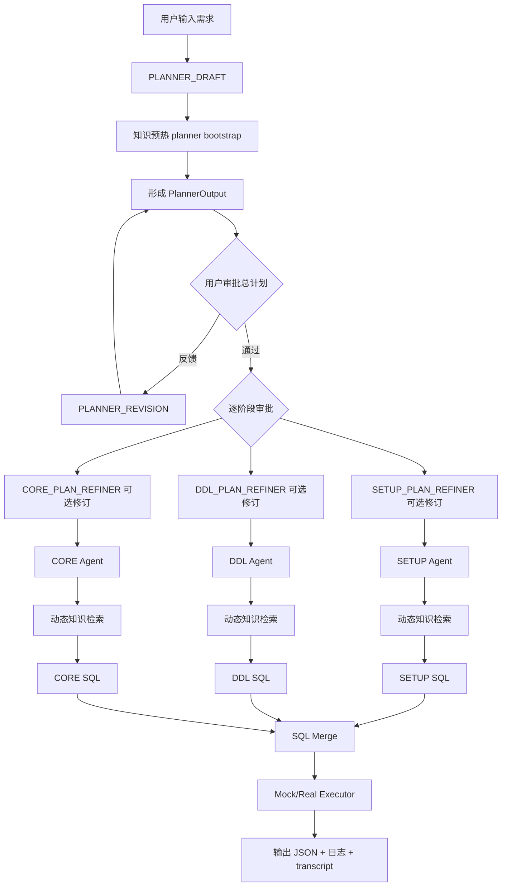

# SqlMate 项目总结

## 1. 项目概述

`SqlMate` 是一个面向数据库功能验证场景的 SQL 测试用例生成工作流。它的核心目标不是“直接让大模型吐一段 SQL”，而是把用户需求拆解成可审阅、可追踪、可验证的多阶段生成流程。

项目当前主要面向如下场景：

- 用户输入一个数据库能力点，例如 `VACUUM`、基础 `DDL/DML`、分区能力等
- 系统先生成结构化测试计划
- 再分别生成 `SETUP`、`DDL`、`CORE` 三个阶段的 SQL
- 在生成过程中动态补齐语法与行为证据
- 最终合并为一份可执行 SQL，并用执行器做基础验证

这使得 `SqlMate` 更接近一个“SQL 测试工作流代理系统”，而不是一个单轮问答式 SQL 生成器。

---

## 2. 项目功能

### 2.1 核心功能

- 基于 OpenAI Agents SDK 编排多节点工作流
- 将用户需求结构化为全局测试计划和阶段子计划
- 将 SQL 生成拆分为 `SETUP`、`DDL`、`CORE` 三个阶段并行执行
- 在阶段生成前后动态检索知识证据，避免无依据语法
- 支持 CLI 交互式审批，用户可逐步审阅和修订计划
- 输出完整 JSON 产物、运行日志、事件日志，便于回放与调试
- 支持 mock executor，在没有真实数据库时也能跑通全链路
- 支持 fallback 结果，避免模型超时或失败直接导致整个流程中断

### 2.2 输出结果

最终输出是结构化 JSON，而不是只有一段 SQL。输出包含：

- `planner_output`
- `setup_result`
- `ddl_result`
- `core_result`
- `merged_sql`
- `execution`

对应模型定义可见 [models.py](/storage/self/primary/ai/SqlMate/SqlMate/app/schemas/models.py:88)。

---

## 3. 使用方法

### 3.1 基本运行

先准备配置文件和环境变量：

```bash
/home/remhero/bin/.venv/bin/python -m app.main \
  --config config/settings.example.yaml \
  --input-file tests/demo_input.json
```

自动审批模式：

```bash
/home/remhero/bin/.venv/bin/python -m app.main \
  --config config/settings.example.yaml \
  --input-file tests/demo_input.json \
  --approval-mode auto
```

交互式运行：

```bash
/home/remhero/bin/.venv/bin/python -m app.main \
  --config config/settings.example.yaml \
  --interactive
```

样例批量运行：

```bash
/home/remhero/bin/.venv/bin/python sample_cases/run_mock_samples.py
```

程序入口位于 [main.py](/storage/self/primary/ai/SqlMate/SqlMate/app/main.py:24)。

### 3.2 运行产物

- 运行日志：`logs/*.log`
- 事件日志：`logs/*.jsonl`
- 最终结果：`output/*.json`
- 样例资产：`sample_cases/inputs`、`sample_cases/outputs`、`sample_cases/transcripts`

---

## 4. 技术路线

## 4.1 总体路线

`SqlMate` 采用的是一条“结构化规划 + 分阶段生成 + 动态知识补证 + 人工审阅 + 执行验证”的路线。

可以概括为：

1. 用户输入需求
2. Planner 生成全局计划和阶段计划
3. 预热知识缓存
4. 用户审批计划
5. `SETUP / DDL / CORE` 并行生成
6. 每个阶段在生成过程中按需多轮检索知识
7. 合并 SQL
8. 执行器验证
9. 落盘结构化结果

### 4.2 流程图



### 4.3 关键模块

- 入口和组装：[main.py](/storage/self/primary/ai/SqlMate/SqlMate/app/main.py:171)
- 总编排器：[orchestrator.py](/storage/self/primary/ai/SqlMate/SqlMate/app/workflow/orchestrator.py:14)
- Planner 编排：[planner.py](/storage/self/primary/ai/SqlMate/SqlMate/app/workflow/planner.py:113)
- Agent 节点：[agent.py](/storage/self/primary/ai/SqlMate/SqlMate/app/nodes/agent.py:78)
- 轻量 LLM 节点：[llm.py](/storage/self/primary/ai/SqlMate/SqlMate/app/nodes/llm.py:15)
- 知识服务：[knowledge.py](/storage/self/primary/ai/SqlMate/SqlMate/app/services/knowledge.py:7)
- Schema 定义：[models.py](/storage/self/primary/ai/SqlMate/SqlMate/app/schemas/models.py:8)
- Provider 绑定：[providers.py](/storage/self/primary/ai/SqlMate/SqlMate/app/services/providers.py:9)

---

## 5. 为什么选择这条技术路线

### 5.1 不选择“单轮直接生成 SQL”

如果只做单轮提示词生成，问题会很明显：

- 容易输出伪 SQL
- 无法证明语法来源
- 不便于插入人工审阅
- 无法追踪“为什么这么写”
- 出错时难以定位是在规划、知识、还是生成环节

SQL 测试用例本质上比普通文本生成更接近“受约束的工程产物生成”，因此必须引入结构化计划、阶段拆分和证据约束。

### 5.2 为什么用 OpenAI Agents SDK

项目使用 Agents SDK 的原因，不只是“能调模型”，而是它同时提供了：

- Agent 抽象
- 工具调用能力
- 多轮运行能力
- 结构化输出能力
- 流式事件能力
- `previous_response_id` 等连续对话上下文能力

在 `AgentNode` 中，系统把知识检索工具直接作为 agent tools 暴露给模型，见 [agent.py](/storage/self/primary/ai/SqlMate/SqlMate/app/nodes/agent.py:107)。

```python
agent = Agent(
    name=self.node_name,
    instructions=prompt,
    model=self.model,
    tools=[inspect_known_evidence, list_available_topics, retrieve_knowledge],
    output_type=AgentOutputSchema(self.output_type, strict_json_schema=False),
)
```

这意味着模型不是被动接收固定上下文，而是可以在生成过程中主动判断“我还缺什么证据”，然后多轮补齐。

### 5.3 为什么要结构化 JSON 输出

项目所有关键阶段都使用 Pydantic schema 约束输出，而不是自由文本。这是因为：

- 便于下游流程消费
- 便于做自动校验和 fallback
- 便于日志落盘与回放
- 便于插入审阅环节
- 便于 UI 和执行器直接读取

例如 `PlannerOutput`、`PhasePlan`、`PhaseResult` 都是明确结构，见 [models.py](/storage/self/primary/ai/SqlMate/SqlMate/app/schemas/models.py:32)。

一个典型阶段结果包含：

- `plan_summary`
- `knowledge_used`
- `generated_sql`
- `validation_notes`
- `unresolved_risks`
- `evidence_checklist`

这比只返回一段 SQL 更适合工程化使用。

### 5.4 为什么拆成 SETUP / DDL / CORE

分阶段有几个直接好处：

- 不同阶段关注点不同，Prompt 更聚焦
- 知识检索可以按阶段隔离
- 并行执行可以缩短总体延迟
- 更容易做质量校验和 fallback
- 更适合人工逐步审阅

在编排器里，三个阶段是并行执行的，见 [orchestrator.py](/storage/self/primary/ai/SqlMate/SqlMate/app/workflow/orchestrator.py:99)。

---

## 6. 从早期 RAG 到动态交互式知识检索的演进

### 6.1 早期思路：基于资料的静态 RAG

较常见的早期做法是：

1. 先把文档或知识资料检索出来
2. 一次性塞给模型
3. 让模型基于这批资料生成 SQL

这个方式的问题是：

- 检索发生在生成前，无法根据中途暴露的新语法需求继续补证
- 容易一次性塞入大量不相关资料，噪音高
- 模型未必真的用到了关键语法证据
- 很难知道“哪些知识是实际生效的”

### 6.2 当前改进：生成过程中按需多轮交互

`SqlMate` 的改进点在于，它把知识检索变成了“生成过程的一部分”，而不是“生成前的一次性准备”。

动态知识检索流程如下：

1. Planner 先做一轮知识预热
2. 阶段 Agent 先检查已有证据
3. 如果不够，再调用工具列主题、查知识
4. 检索结果合并到共享 `knowledge_cache`
5. Agent 可在同一轮运行中继续判断是否需要再检索
6. 只有证据足够后才开始写 SQL

对应工具见 [agent.py](/storage/self/primary/ai/SqlMate/SqlMate/app/nodes/agent.py:29)：

- `inspect_known_evidence(stage)`
- `list_available_topics(stage)`
- `retrieve_knowledge(stage, topics, reason)`

知识服务会记录每轮检索，形成 `retrieval_rounds`，见 [knowledge.py](/storage/self/primary/ai/SqlMate/SqlMate/app/services/knowledge.py:39)。

### 6.3 这条改进路线的优势

- 更贴近真实 SQL 生成过程中的不确定性
- 只在需要时拉取知识，减少无效上下文
- 能显式记录缺失知识和已知证据
- 更容易定位生成失败原因
- 更适合后续接入远程知识源、文档库、版本化语法库

---

## 7. 关键技术细节

### 7.1 Prompt 运行时加载

Prompt 不写死在代码里，而是运行时从 `node_prompts/` 读取，见 [prompt_loader.py](/storage/self/primary/ai/SqlMate/SqlMate/app/services/prompt_loader.py:6)。

优点：

- Prompt 可独立迭代
- 节点职责更清晰
- 可按不同节点细分约束
- 更方便做 A/B 调整和业务适配

### 7.2 Provider Registry

不同节点通过 `node_bindings` 绑定不同 provider/model，见 [config.py](/storage/self/primary/ai/SqlMate/SqlMate/app/config.py:87) 与 [providers.py](/storage/self/primary/ai/SqlMate/SqlMate/app/services/providers.py:14)。

这样做的优势：

- Planner 和 SQL 生成节点可用不同模型
- 能灵活切换 Responses API 或 Chat Completions API
- API key/base_url 与业务代码解耦

### 7.3 快速本地 Planner 与远程 Planner 的折中

在 [planner.py](/storage/self/primary/ai/SqlMate/SqlMate/app/workflow/planner.py:9) 中，项目保留了一个本地快速 draft 构造器 `_build_local_draft()`。

原因写得很直接：

- 远程 planner draft 可能过慢
- CLI 工具更关心整体可用性
- 本地 draft 可以更好对齐现有知识库 topic 命名

这是一种典型工程折中：不是盲目追求“每一步都必须在线大模型生成”，而是在延迟、稳定性、知识对齐之间找平衡。

### 7.4 结构化输出与宽松 JSON Schema

无论是 `LLMNode` 还是 `AgentNode`，都通过：

```python
AgentOutputSchema(self.output_type, strict_json_schema=False)
```

来要求结构化输出，见 [llm.py](/storage/self/primary/ai/SqlMate/SqlMate/app/nodes/llm.py:35) 和 [agent.py](/storage/self/primary/ai/SqlMate/SqlMate/app/nodes/agent.py:111)。

这里使用 `strict_json_schema=False`，意味着：

- 仍然以 schema 为目标
- 但不过度提高模型输出失败率
- 最终再由 Pydantic 做二次校验和标准化

这是非常实用的工程策略，因为对生成式系统来说，过严的 schema 约束常常会牺牲稳定性。

### 7.5 共享知识缓存

Planner 预热出来的知识会写入共享 `knowledge_cache`，阶段 Agent 再基于它继续补证，见：

- [planner.py](/storage/self/primary/ai/SqlMate/SqlMate/app/workflow/planner.py:167)
- [agent.py](/storage/self/primary/ai/SqlMate/SqlMate/app/nodes/agent.py:17)

这能避免每个阶段从零开始查知识。

### 7.6 质量校验与 fallback

项目没有把“执行器验证”当作唯一安全网，在执行前先做轻量 SQL 质量检查，见 [sql_quality.py](/storage/self/primary/ai/SqlMate/SqlMate/app/services/sql_quality.py:6)。

例如：

- `SETUP` 不能生成表定义 SQL
- `DDL` 必须包含 `CREATE TABLE`
- `CORE` 必须包含 `INSERT INTO` 和 `SELECT`

如果阶段超时、报错或质量不达标，可以回退到本地确定性 SQL 模板，见 [sql_fallback.py](/storage/self/primary/ai/SqlMate/SqlMate/app/services/sql_fallback.py:6)。

这保证了系统在最差情况下仍然能产出结构化结果，而不是整条链路失败。

### 7.7 交互式审批

CLI 在以下节点暂停等待人工确认：

- 总 planner 输出
- `SETUP` 子计划
- `DDL` 子计划
- `CORE` 子计划

说明见 [INTERACTIVE_REVIEW.md](/storage/self/primary/ai/SqlMate/SqlMate/docs/INTERACTIVE_REVIEW.md:1)。

这条机制非常适合测试用例生成，因为业务方往往比模型更清楚：

- 哪些路径必须覆盖
- 哪些异常场景最关键
- 哪些环境限制需要事先写进计划

---

## 8. 代码层面的执行链条

### 8.1 程序入口

[main.py](/storage/self/primary/ai/SqlMate/SqlMate/app/main.py:171) 负责：

- 读取配置
- 初始化 UI、PromptLoader、KnowledgeService、ProviderRegistry
- 构造 planner 节点和 phase 节点
- 启动 orchestrator

### 8.2 Planner 链路

[planner.py](/storage/self/primary/ai/SqlMate/SqlMate/app/workflow/planner.py:136) 中的 `run()` 完成：

- 构建 draft
- planner bootstrap 检索知识
- 生成 `PlannerOutput`
- 供 UI 审批

### 8.3 阶段执行

[orchestrator.py](/storage/self/primary/ai/SqlMate/SqlMate/app/workflow/orchestrator.py:43) 中，阶段节点会收到统一 payload：

- `user_input`
- `global_plan`
- `phase_plan`
- `cached_knowledge`
- `shared_contract`
- `knowledge_instruction`

其中 `knowledge_instruction` 很关键：

```json
{
  "must_collect_evidence_before_sql": true,
  "continue_retrieving_until_uncertain_topics_are_resolved": true
}
```

这明确把“先补证据、再写 SQL”变成了系统契约，而不是提示词中的模糊建议。

### 8.4 结果合并

三个阶段结果会被合并成：

```sql
-- SETUP
...

-- DDL
...

-- CORE
...
```

然后再进入执行器，见 [orchestrator.py](/storage/self/primary/ai/SqlMate/SqlMate/app/workflow/orchestrator.py:102)。

---

## 9. 技术路线的优势

### 9.1 相比单轮生成

- 可解释性更强
- 可审阅性更强
- 输出更稳定
- 更适合复杂 SQL 场景
- 更适合团队协作和复盘

### 9.2 相比单次静态 RAG

- 检索更按需
- 上下文噪音更低
- 能记录缺失知识
- 能多轮补证
- 更适合语法约束型任务

### 9.3 相比纯人工写测试 SQL

- 规划和模板复用效率高
- 结构化输出便于自动处理
- 更容易扩展到新数据库方言
- 更容易落入持续回归链路

---

## 10. 最终效果展示

### 10.1 最终输出结构示例

真实输出样例可见 [06f2786883bb4a95aca3e14a3fc3a2b7.json](/storage/self/primary/ai/SqlMate/SqlMate/output/06f2786883bb4a95aca3e14a3fc3a2b7.json:1)。

该输出展示了：

- 全局测试目标
- 分阶段计划
- 每个阶段的知识缓存命中/缺失情况
- 阶段 SQL 结果
- 合并 SQL
- 执行结果

其中一个很有价值的点是，输出不只告诉你“生成了什么”，还告诉你：

- 当时查了哪些知识
- 哪些知识没有命中
- 阶段假设是什么
- 风险是什么

### 10.2 CLI 交互效果

CLI 层会：

- 显示品牌 banner
- 流式展示节点 reasoning / text / tool output
- 在 planner 和子计划上做审批
- 记录终端历史，方便回滚查看

对应代码见 [console.py](/storage/self/primary/ai/SqlMate/SqlMate/app/ui/console.py:21)。

### 10.3 适合演示的项目亮点

- “不是直接生成 SQL，而是先生成计划”
- “不是一次性 RAG，而是生成过程中的多轮补证”
- “不是只要成功输出，而是保留全过程结构化痕迹”
- “不是完全黑盒，而是允许人工在关键节点审阅”

---

## 11. 当前限制与后续演进方向

### 11.1 当前限制

- 当前默认执行器仍是 `MockSqlExecutor`
- 本地知识库仍是阶段化 KV store，不是外部文档系统
- 真实 repair loop 还未形成完整闭环
- `strict_json_schema=False` 说明结构化约束仍偏务实，不是强硬强校验模式

### 11.2 建议的下一步

- 接入真实数据库执行器
- 将 `knowledge/` 扩展为版本化知识源
- 增加真实错误信息驱动的 repair loop
- 为不同数据库方言建立独立 prompt 与知识维护规范
- 引入更细粒度的 SQL 质量规则与回归样例库

---

## 12. 一句话总结

`SqlMate` 的本质，是把“数据库测试 SQL 生成”从单轮文本生成问题，升级成了一个可规划、可补证、可审阅、可执行、可追踪的 Agent 工作流问题。
